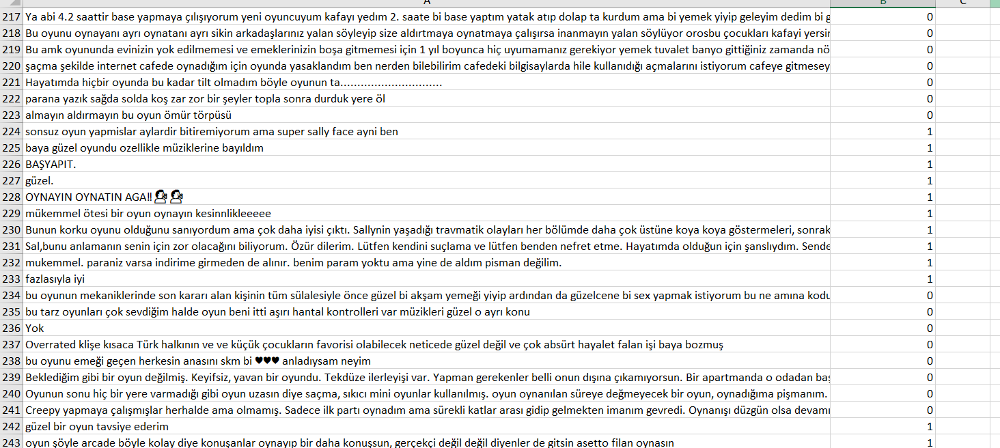
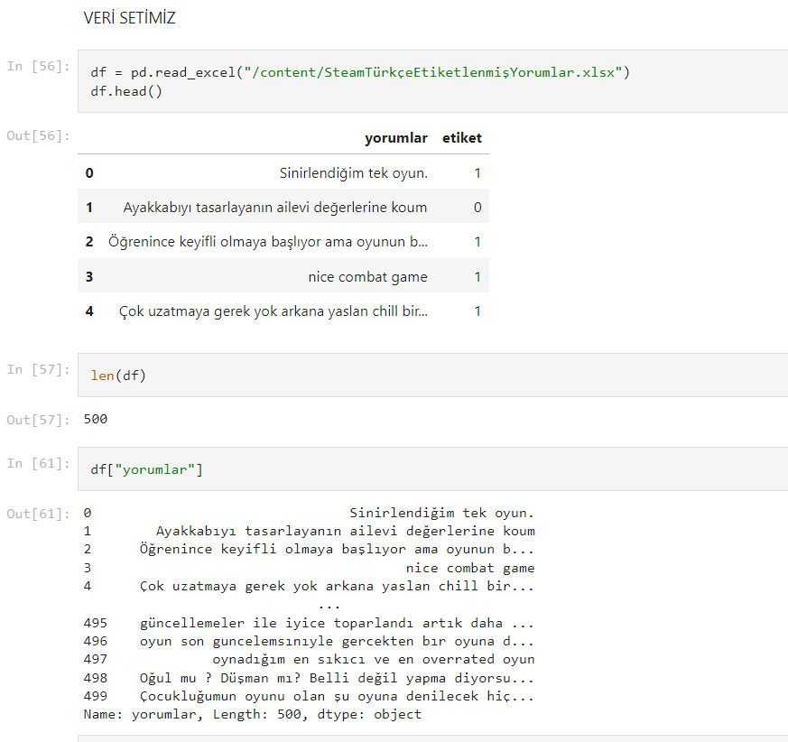
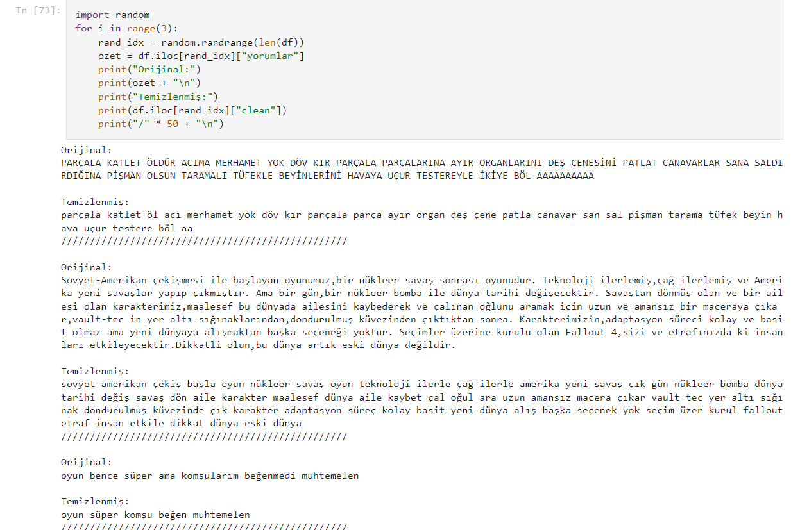
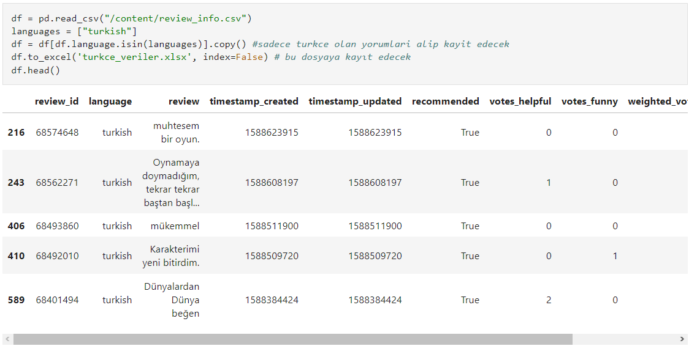
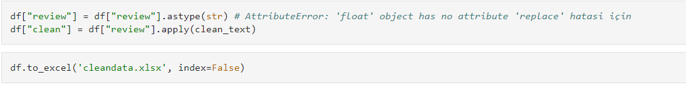
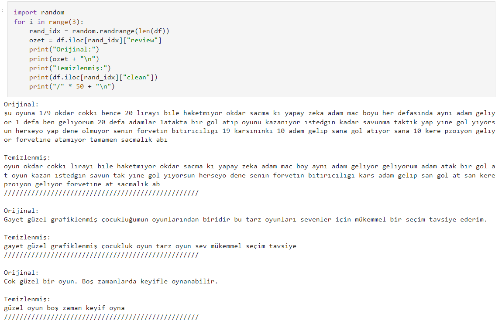

# Oyunlar Feedback Analiz Modeli
İlk denememde sonuçalar biraz düşük olduğu için yeni bir veri setiyle tekrar denedim. O yüzden ilk denememdeki dosyalar İlk Deneme klasöründe ikinci denemem ise ikinci deneme klasörümde.
## Veri Setinin oluşturulması
- Öncelikle steamden seçtiğim popüler oyunların mağaza sayfasından Müşteri İncelemelerinden verileri tek tek kopyalayıp excel'e kayıt ettim. Daha sonra Olumlu ise 1 - Olumsuz ise 0 yazarak etiketledim. + Olabildigince gördüğüm argo kelimeleri sansürlemeye çalıştım.


## Veri Setini Temizleme
* Bende derslerde kullandığımız stop_word dosyasını kullandım. Ve temizlemek için clean_text fonksiyonunu kullandım. Veri setimizi aşağıdaki fotoğraftaki gibi görebiliyoruz.

* Daha sonra ``` df['clean'] = df['yorumlar'].apply(clean_text) ``` ile bütün yorumalar satırları üzerinde clean_text fonksiyonumuzu uygulayıp clean isimli sütuna kayıt ediyoruz. ``` df.to_excel('temizlenmis_veriler.xlsx', index=False) ``` ile de yeni dosyamızı excel olarak tekrar kayıt ediyoruz. Temizlenmiş verileri kontrol etmek için derste kullandığımız fonksiyonu kullanıyorum.  
  

## Modelin Oluşturulması
- Derste yaptığımız NB ,Desicion Tree, Grid Search örneklerini kendi veri setime göre düzelterek yazdım.  
### Farklı Modellerdeki Sonuçlar:  
NB Test F1 Score: 0.7401574803149606  
DT Test F1 Score: 0.6346153846153846  
Grid Search: 0.54  
Sonuçlar ne yazıkki beklediğimden kötü çıktı. Bunun sebebinin veri setimin kötü ve küçük olmasından kaynaklı olduğunu düşünüyorum.


## Tekrardan
Buradan sonrası tekrar bir veri seti bulup onu temizleyip aynı modellerimde test edilmesini anlatıyor.
## Veri setinin oluşturulması
#### ikinci deneme klasöründeki kodların açıklaması
İnternetten daha büyük bir veri seti bulamaya çalıştım. Ve aşağıdaki linkte türkçe yorumların olduğunu da gördüm. https://www.kaggle.com/datasets/sridharstreaks/game-reviews-dataset?select=review_info.csv 
- İlk olarak languages sütunundan turkish olarak işaretlenmiş yorumları ayıklayıp bir excel dosyasına kayıt ettim. 21320 adet Türkçe yorum varmış.

- Daha sonra aldığım hata yüzünden review satırını stringe dönüştürüp her satıra clean_text fonksiyonunu uyguladım.

- Daha elle tutulur bir veri seti:

## Verilerin etiketlenmesi
- Verilerin recomended satırında DOĞRU ve YANLIŞ olarak etiketlendiğini gördüm. O yüzden o etiketleri kullanarak yeni bir etiket satırı açıp DOĞRU için 1, YANLIŞ için 0 olarak etiketledim. Daha sonra yazdığım kodun işe yaramadığını gördüm çünkü recommended sütunu boolean olarak True ve False işaretlenmiş. Kodlarımı ona göre değiştim ve etiketleme işlemnini de tamamladım. ```df['etiket'] = df['recommended'].apply(lambda x: 1 if x == True else 0)```


